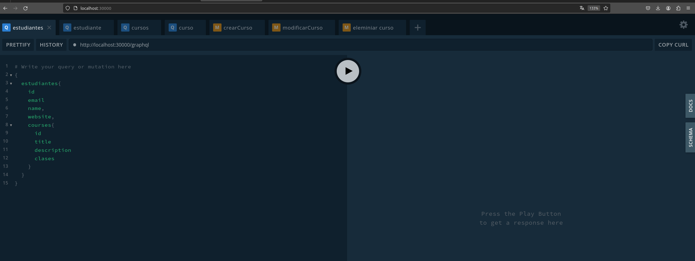
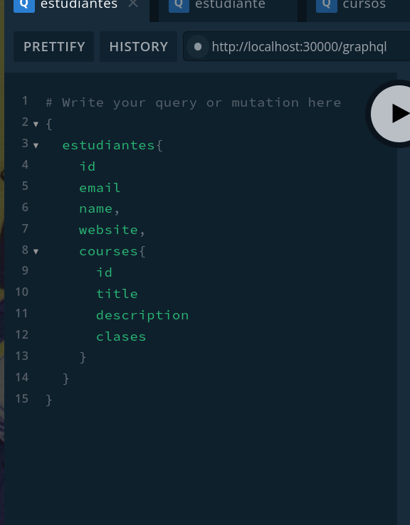
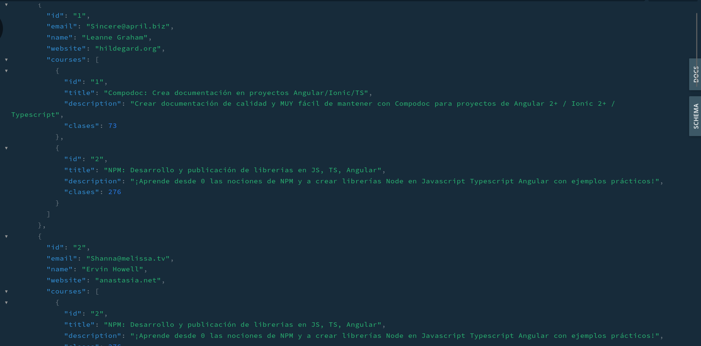
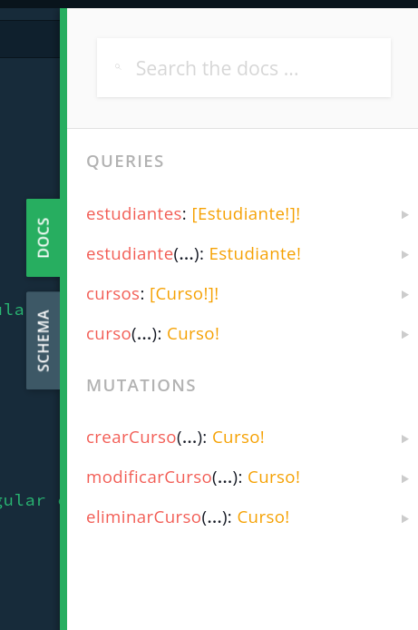

# graphql_academiaOnline

## Español

### Correr el proyecto

- en una terminal ingresar el comando ***npm run start:dev***
- vaya a la url: http://localhost:30000/
- si todo salio exitosamente deberia verse una pantalla (playground) tal que asi :

- del lado izquierdo se realizan las consultas

- del derecho esta la info de salida y la documentacion de la api

